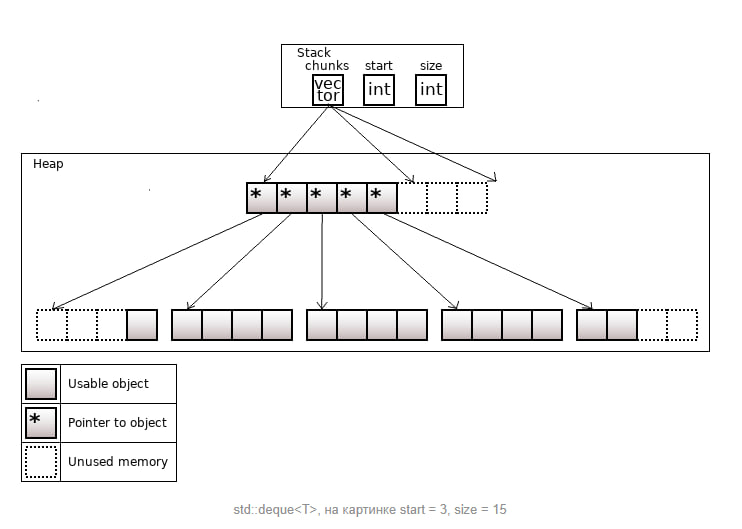

# Дэк

Реализуйте в свободной форме std::deque, использующий архитектуру с чанками:

Важно, что у вас отсутствует инвалидация итераторов/указателей при реалокации дэка.

Правило пяти следует соблюсти в данном контейнере.

Реализуйте следующие методы:
- **push_back** // Вставить в конец дэка, O(1)
- **push_front** // Вставить в начало дэка, O(1)
- **pop_back** // Удалить один элемент из конца дэка, O(1)
- **pop_front** // Удалить один элемент из начало дэка, O(1)
- **back** // Получить доступ к последнему элементу дэка, O(1)
- **front** // Получить доступ к первому элементу дэка, O(1)
- **operator []** // Получить доступ к произвольному элементу дэка, O(1)
